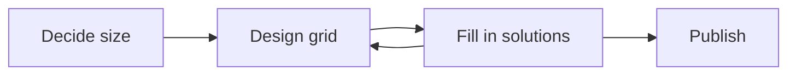

# KryssKross Web App - Design Document

## 1. Project Goal

To create a web application enabling users to:

- **Create:** Design crossword puzzles using an interactive editor. Should eventually support both traditional and "arrow words" (Scandinavian/Swedish) styles.
- **Save**: Puzzles should be able to be saved, and subsequently loaded.
- **Solve:** Solve these puzzles directly within the web application.
- **Share:** Embed puzzles (primarily the solver interface) onto other websites.
- **Export/Print:** Generate printable versions and PDF documents of the puzzles.

**Initial Focus:** Core construction of traditional style puzzles, saving and solving functionality. User management (registration, login, puzzle ownership) will be addressed in a later phase.

## 2. Core Features

- **Puzzle Construction:**
    - Interactive grid editor.
    - Define solution layout and empty/filler cells.
    - Add clues associated with solution words.
    - Automatic validation and feedback during creation.
- **Puzzle Solving:**
    - Interactive grid for inputting letters.
    - Highlighting of active clue/word.
    - Navigation via keyboard/mouse.
    - (Optional) Answer checking, reveal functions.
- **Sharing:**
    - Generate `<iframe>` embed code for specific puzzles (solver view).
- **Export/Print:**
    - Browser-native printing using print-specific stylesheets.
    - PDF generation (blank or with solution).

## 3. Key Technologies

- **Backend Language:** PHP
    - **Framework Recommendation: Symfony** (Interest in learning, flexibility, strong architecture).
    - **Alternative: Laravel** (Existing familiarity, potentially faster initial development) with **Filament**.
- **Frontend Language:** TypeScript
    - **Rationale:** Enhances JavaScript with static typing for better maintainability, tooling, and error detection in complex UI logic.
- **Frontend Framework:**
    - **React** because I need to learn it.
- **Rendering Engine:** SVG (Scalable Vector Graphics)
    - **Rationale:** Ideal for vector-based grid layouts, scales perfectly for screen/print/PDF, directly manipulable via TypeScript for interactivity.
- **Database:** Relational Database (e.g., PostgreSQL, MySQL)
    - **Data Storage:** Puzzle structure, clues, and metadata. Grid/clue data likely stored efficiently within a JSON or TEXT column per puzzle record initially.

## 4. Puzzle Representation

### Traditional puzzles

- **Cell Types:**
	- `Blocked Cell`: They're black, and they're blocked.
	- `Solution Cell`: Standard white cell where solver inputs letters.
- **Dividers:** Some solutions might be divided into two or more words, denoted by the word length given in the clues. Dividers might be a thicker border between cells (3,5), or a hyphen across the border between cells (3-5).

### Arrow-words puzzles

- **Cell Types:**
    - `Solution Cell`: Standard white cell where solver inputs letters.
    - `Clue Cell`: Typically an adjacent non-solution cell containing clue text and directional arrow(s). May be visually divided (e.g., diagonally) to hold multiple clues.
    - `Empty Cell`: Unused grid space, visually distinct (e.g., using an SVG `<pattern>` fill with 45-degree hatch lines, common in Norwegian style, instead of solid black).
- **Data Format (Proposed):** JSON object per puzzle.
    - `metadata`: { id, title, width, height, ... }
    - `grid`: 2D array representing cell types at each coordinate (e.g., 'solution', 'empty').
    - `clues`: Array of objects, each containing:
        - `text`: The clue string.
        - `clueCellCoords`: { row, col } of the cell containing the clue text/arrow.
        - `solutionStartCoords`: { row, col } of the first letter of the answer.
        - `direction`: 'across' or 'down'.
        - `answer` (Optional but recommended): The solution string for validation.
        - `status` (Internal): e.g., 'valid', 'needs_review', 'invalid' (managed by constructor).

## 5. Construction Workflow & UI

### Traditional:

- There should be a setting for using rotational symmetry of black cells. (Or should that always be the case?)

### Arrow Words:
- **Dual Editing Modes:**
    1. **"Edit Solution" Mode:**
        - Focus: Defining the grid structure by placing `Solution Cells` and `Empty Cells`.
        - Logic: App automatically identifies contiguous sequences of `Solution Cells` as potential words (horizontal/vertical).
    2. **"Edit Clues" Mode:**
        - Focus: Associating text clues with the potential words identified above.
        - UI: Highlights potential word starts. User selects one (or an adjacent `Clue Cell`) to add/edit clue text.
        - Logic: App attempts automatic arrow placement within the `Clue Cell`. Handles multiple clues/arrows originating from the same cell.
- **Validation on Solution Change:**
    - When the solution layout is modified, the app must re-evaluate all existing clues.
    - It compares clues against the new potential word list.
    - Clues are marked internally and visually flagged in the UI as:
        - `Valid`: No issues.
        - `Invalid`: Word path broken/non-existent (suggest deletion).
        - `Needs Review`: Word path exists but length/structure changed (user must verify/update clue).
    - New potential words without clues are also highlighted.

## 6. Solving Workflow & UI

### Traditional
- Load puzzle data (grid, clues) from the backend API.
- Render puzzle using SVG.
- Allow letter input into `Solution Cells`.
- Implement keyboard (arrow keys, tab) and mouse navigation between cells, highlighting the applicable clue.
### ArrowWords
- Load puzzle data (grid, clues) from the backend API.
- Render the puzzle using SVG, applying appropriate styles for `Solution`, `Clue`, and `Empty` cells (including pattern fills).
- Allow letter input into `Solution Cells`.
- Implement keyboard (arrow keys, tab) and mouse navigation between cells/clues.
- Highlight the currently selected clue and its corresponding `Solution Cells`.
- (Optional) Provide "Check Puzzle", "Reveal Letter/Word" functionality.

## 7. Sharing (Embedding)

- Create a dedicated backend route (e.g., `/puzzles/{puzzleId}/embed`).
- This route serves a minimal HTML page loading the solver component, configured for the specific `puzzleId`.
- Provide users with a simple `<iframe>` code snippet pointing to this embed URL.

## 8. Exporting & Printing

- **Print:** Use CSS `@media print` rules to optimize the puzzle's appearance for direct browser printing (hide UI chrome, ensure clear lines/text).
- **PDF:**
    - **Client-side Option:** Use JS libraries (e.g., `jsPDF` + `svg2pdf.js` or `canvg`) to generate the PDF in the user's browser.
    - **Server-side Option:** Send puzzle data to the PHP backend and use libraries (e.g., `TCPDF`, `DomPDF`) or a headless browser service to generate a more robust PDF.

## 9. Development Priorities (Initial Phase)

1. Set up Backend project (Symfony/Laravel), Database model, basic API endpoints (Save/Load Puzzle).
2. Set up Frontend project (TypeScript + React).
3. Implement core SVG rendering logic for grid and different cell types (incl. pattern fill).
4. Develop "Edit Solution" mode functionality.
5. Develop "Edit Clues" mode functionality, including the crucial validation logic.
6. Develop the basic Puzzle Solving interface.
7. Iterate and refine the core construction/solving loop based on testing.
8. Implement Sharing (Embedding).
9. Implement Print/PDF Export functionality.
10. Defer user accounts and advanced features to a subsequent phase.